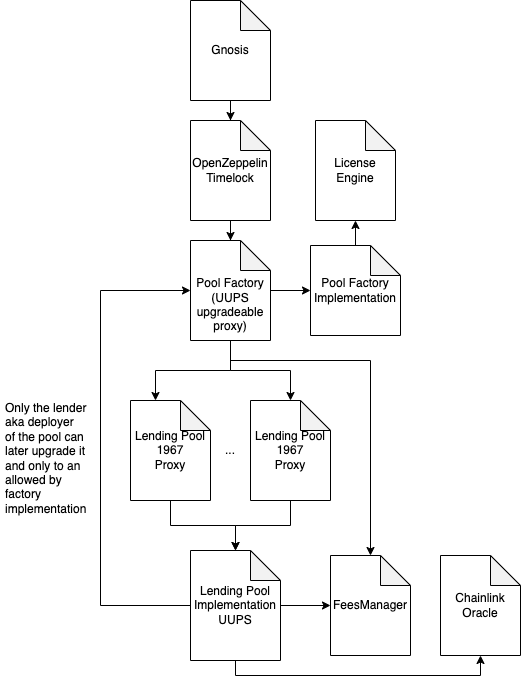

# Vendor Finance
**Vendor Finance** is a lending platform that allows any large token holder ofer loans on their own terms. Vendor loans are at fixed rates and non-liquidatable. All loans have an expiry. Lenders also have an ability to deploy pools for a limited set of people a.k.a private pools. 

In order to simulate the endless borrowing present on such platfroms like AAVE we have introduced the concept of rollovers. Given that certain criterias are met the borrowers can rollover the debt from one pool to a new pool with a longer expiry even if the second one had not been seeded.

Vendor Finance had not yet undergone a formal code review process, so please use it at your own risk.

## Contracts
`VendorPoolFactory` - This is a factory contract that allows to deploy isolated lending pools permissionlesly. Both lend and collateral tokens must be whitelisted by the Vendor protocol first. On creation of the lending pool factory passes all the required parameters as well as computes any possible discounts the lender might have. We will describe the discounts in the section on `LicenseEngine`

`VendorFeesManager` - This contract keeps track of the borrowing fee rates for each pool as well as the fee type for each pool. There are 2 types of borrowing fees:

- Constant - rate is set to certain number in % and no matter at what moment in the lifespan of the pool borrower borrows the funds borrower will always be charged a flat fee. 
- Dynamic - lenders set the rate as annualized fee. So if dynamic rate is set to 10% that means that if the pool was was 1 year long borrowers would need to pay 10% as a fee if they borrowed as soon as the pool was created. Then the effective rate will go down to ensure that the borrower always pays 10% when annualized. So if one borrowes 6 months into the existence of this pool they will have an effective rate of 5%.   

`VendorLicenseEngine` - Vendor protocol will sell licenses in a form of an NFT that can grant certain benefits to lenders holding them. Each license NFT comes with a discount that is applied to the fees charged by Vendor both on collaral defaulted and interest made, amount of pools that can be deployed using this NFT and the time span that this NFT will be active for. If one lender holds more than 1 NFTs the one with the highest discount should be applied. 

`VendorOracle` - We use oracles in order to check if the collateral price is higher than the amount the borrower will get for the unit of collateral at the moment of borrowing. At the moment we only support assets that are listed on Chainlink.

`LendingPoolImplementation` - This is the main contract that is responsible for the borrowing and lending of the assets. It is implemented as an upgreadable proxy, but this proxy can only be upgraded by the lender a.k.a deployer of the pool and only when the upgrades are allowed by Vendor and only to the allowed implementation. Here are some of the main features of this contract:
- Borrow - deposit `COL_TOKEN_AMOUNT` of collateral and get the `COL_TOKEN_AMOUNT*MINT_RATIO` of lend token. When you borrow, the borrow fees will be added on top of the borrwed amount. So borrower will need to repay more than was borrowed. Borrowing should be automatically disabled when the value of lend tokens lent per unit of collateral is less than the value of unit of collateral. 

        Ex: borrowing in the ETH<>DAI pool with mint ratio of 2500 should be disabled when when price of ETH is bellow 2500 assuming price of DAI is 1. 

    Lenders can also pause borrowing but not repaying in the pool. 
- Repay - deposit `LEND_TOKEN_AMOUNT` of lend token and get the `LEND_TOKEN_AMOUNT/MINT_RATIO` collateral token amount. Fees will always be charged first. If user owes 100DAI and 10DAI in fees user will not get any collateral if user repays any amount below 10 DAI.

- Withdraw/Deposit - Lenders can also withdraw and deposit funds to the pool. Although lender should not be able to take the funds that are owed to Vendor. Vendor charges 10% of interest earned as well as 10% of collateral defaulted.

- Rollover - borrowers can rollower their funds into a pool with a longer expiry if three conditions are met: 1) both pools have same lender 2) Both pools have same collateral and lend token 3) Second pool has a longer expiry.

- Lender Rollover - convenience method for moving availiable lend funds to a pool of the same lender and a further expiry. Lend token should also be same while colateral token could be different.

## Security Mechanisms
In order to be able to respond to potential issues that might arise during the life of the protocol we have implemented follwing defence mecahnisms:

- Lending Pools are pausable by Vendor. Individual pools can be paused as well as all pools at once.
- Methods in the lending pool have reentrancy guards.
- In case a pool expires while paused resulting in defaults, lender can extend the expiry by 3 days to facilitate repays.
- Pools are proxies deployed by a factory so new implementation can be used in new pools easily.
- Old pools can also be upgraded if the lender agrees to upgrade the pool to a proposed implmentation.
- Factory contract has a two-step owner transfer mechanism.
- Factory contract will sit behid the OZ temilock contract.

## Documentation
You can find more details about the operations of the protocol in our documnentation [here](docs.vendor.finance).

## Architecture

